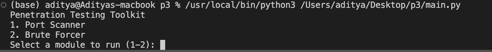
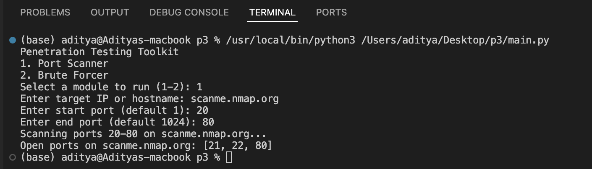
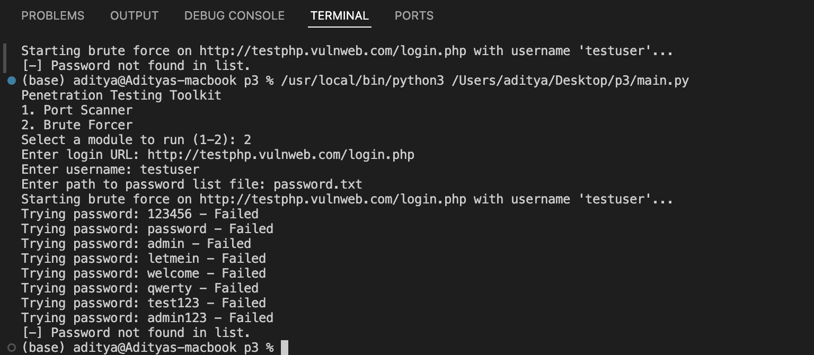

# Penetration Testing Toolkit

**COMPANY** :- CODTECH IT SOLUTIONS 

**NAME** : KUNUKU SUSHMA 

**INTERN ID** : CT06DN1234

**DOMAIN** : Cyber Security & Ethical Hacking

**DURATION** : 6 WEEKS

**MENTOR** : NEELA SANTOSH 

## Overview
A modular Python toolkit for penetration testing with multiple modules.

## Modules

### Port Scanner
- Scans a range of ports on a target host.
- Usage: Select module 1, enter target and port range.

### Brute Forcer
- Attempts to brute force login on a web form.
- Usage: Select module 2, enter login URL, username, and password list file path.
- Note: Adjust the POST data and success condition in `brute_forcer.py` as needed.

## Requirements
- Python 3.x
- `requests` library (`pip install requests`)

## 🔐 Screenshots

### Result


### Port Scanner


### Brute Forcer


## Running the Toolkit
```bash
python main.py
